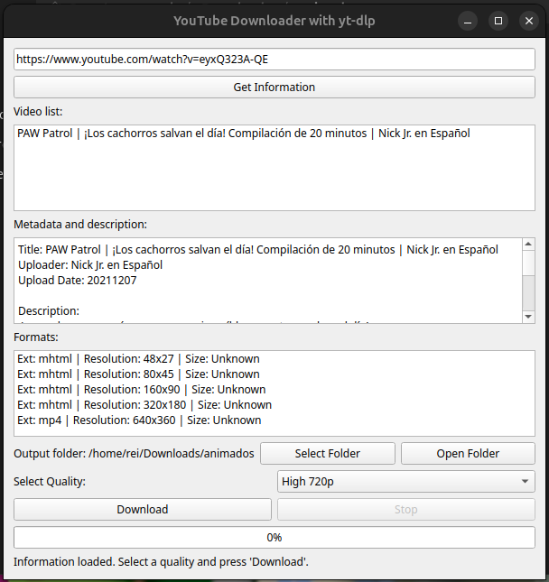
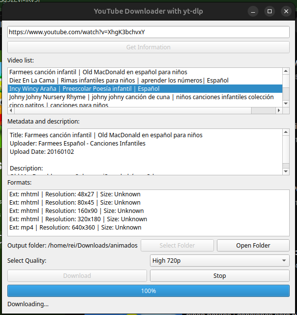

# 🎬 YouTube Downloader

<div align="center">


**A modern, cross-platform GUI application for seamless YouTube video downloads**

[Features](#-features) • [Screenshots](#-screenshots) • [Installation](#-installation) • [Usage](#-usage) • [Troubleshooting](#-troubleshooting)

</div>

---

## 📋 Overview

This powerful YouTube downloader combines the robustness of [yt-dlp](https://github.com/yt-dlp/yt-dlp) with an intuitive PyQt5 GUI. It's designed for developers and power users who need reliable, high-quality video downloads with advanced features like:

- **Cookie-based authentication** to bypass 403 errors
- **Playlist support** with sequential downloading
- **Multithreaded operations** for smooth UI performance
- **Persistent configuration** to save your preferences
- **Format flexibility** with multiple quality options

Perfect for content creators, researchers, and anyone who needs to download YouTube content efficiently.

---

## ✨ Features

### 🔐 Authentication & Security
- **Cookie-based authentication** using [YouTube Cookies Exporter](https://github.com/reiarseni/youtube-cookies-exporter)
- **Automatic 403 error resolution** with fresh cookies
- **Secure credential handling** - no passwords stored

### 📥 Download Capabilities
- **Single video downloads** with format selection
- **Full playlist support** - download entire playlists sequentially
- **Quality options** from 144p to 1080p and audio-only
- **Automatic metadata fetching** - titles, descriptions, uploader info
- **Smart format selection** - best video/audio merging with FFmpeg

### 🎨 User Experience
- **Modern PyQt5 GUI** with intuitive interface
- **Real-time progress tracking** with speed and ETA display
- **Multithreaded operations** - UI never freezes
- **Persistent configuration** - remembers your preferences
- **Double-click playlist navigation** for easy video selection
- **Folder management** - select and open download folders instantly

### 🛠️ Technical Excellence
- **Cross-platform compatibility** (Windows, macOS, Linux)
- **Error handling** with user-friendly messages
- **Cooperative cancellation** - stop operations gracefully
- **Logging system** for debugging and troubleshooting
- **Clean architecture** with separation of concerns

---

## 📸 Screenshots

### Single Video Download


*Download individual videos with quality selection and real-time progress tracking*

### Playlist Download


*Manage entire playlists with sequential downloading and per-video metadata*

---

## 🚀 Installation

### Prerequisites

Before you begin, ensure you have the following installed:

- **Python 3.8 or higher** - [Download here](https://www.python.org/downloads/)
- **FFmpeg** - Required for video/audio merging
- **Node.js 20+** - Required for YouTube JavaScript challenge solving (optional but recommended)

### Step 1: Install System Dependencies

#### Windows
```powershell
# Download FFmpeg from https://ffmpeg.org/download.html
# Add to system PATH or install via chocolatey:
choco install ffmpeg

# Install Node.js from https://nodejs.org/
```

#### Linux (Debian/Ubuntu)
```bash
# Update package list
sudo apt update

# Install FFmpeg
sudo apt install ffmpeg

# Install Node.js (20+)
curl -fsSL https://deb.nodesource.com/setup_20.x | sudo -E bash -
sudo apt install -y nodejs
```

#### macOS
```bash
# Install Homebrew if not already installed
/bin/bash -c "$(curl -fsSL https://raw.githubusercontent.com/Homebrew/install/HEAD/install.sh)"

# Install FFmpeg
brew install ffmpeg

# Install Node.js
brew install node
```

### Step 2: Clone the Repository

```bash
# Clone the repository
git clone https://github.com/reiarseni/youtube-downloader.git

# Navigate to the project directory
cd youtube-downloader
```

### Step 3: Create Virtual Environment (Recommended)

```bash
# Create a virtual environment
python3 -m venv .venv

# Activate virtual environment
# On Linux/macOS:
source .venv/bin/activate
# On Windows:
.venv\Scripts\activate
```

### Step 4: Install Python Dependencies

```bash
# Install required packages
pip install -r requirements.txt

# Or install individually
pip install yt-dlp PyQt5 yt-dlp-ejs
```

### Step 5: Verify Installation

```bash
# Check yt-dlp version
yt-dlp --version

# Check FFmpeg
ffmpeg -version

# Check Node.js
node --version
```

### Step 6: Run the Application

```bash
python main.py
```

---

## 📖 Usage

### Initial Setup

#### 1. Configure Cookies (Recommended)

To avoid 403 errors and access restricted content:

1. Install the [YouTube Cookies Exporter](https://github.com/reiarseni/youtube-cookies-exporter) Chrome extension
2. Visit YouTube and log in to your account
3. Export your cookies using the extension
4. Save the exported file as `cookies.txt` in your `~/Downloads` folder

> **Note:** Without cookies, you may encounter 403 errors or be unable to download certain videos.

#### 2. Launch the Application

```bash
python main.py
```

### Downloading Videos

#### Single Video Download

1. **Enter URL** - Paste a YouTube video URL in the input field
2. **Get Information** - Click "Get Information" to load video metadata
3. **Select Quality** - Choose your preferred quality from the dropdown
4. **Choose Output Folder** - Click "Select Folder" to set download location
5. **Download** - Click "Download" to start downloading

#### Playlist Download

1. **Enter Playlist URL** - Paste a YouTube playlist URL
2. **Get Information** - Click "Get Information" to load playlist
3. **Browse Videos** - The playlist list appears with all video titles
4. **Select Video** - Double-click any video to view its details
5. **Choose Quality** - Select your preferred quality
6. **Set Output Folder** - Choose where to save downloads
7. **Download** - Click "Download" to download the selected video
8. **Automatic Progression** - The app automatically downloads the next video in the playlist

### Advanced Features

#### Metadata Viewing
- View video title, uploader, upload date, and full description
- Available formats are displayed with resolution and file size

#### Quality Options
- **Low 144p** - Best for slow connections
- **Low 240p** - Good for mobile viewing
- **Medium 360p** - Standard quality
- **Medium 480p** - Enhanced quality
- **High 720p** - HD quality
- **High 1080p** - Full HD
- **Audio Only** - Extract audio only
- **Best Quality** - Maximum available quality

#### Folder Management
- **Select Folder** - Choose custom output directory
- **Open Folder** - Open the download folder in your file manager
- **Last Downloaded** - On Windows, the last downloaded file is highlighted

#### Stopping Operations
- Click **Stop** to cancel any ongoing download or information fetch
- The operation stops gracefully without corrupting files

---

## 🛠️ Troubleshooting

### Common Issues

#### 403 Forbidden Error
**Problem:** Download fails with "403 Forbidden" error

**Solution:**
1. Refresh your YouTube page in the browser
2. Export fresh cookies using the extension
3. Update `cookies.txt` in `~/Downloads`
4. Restart the application

#### JavaScript Challenge Failed
**Problem:** "n challenge solving failed" error

**Solution:**
1. Ensure Node.js 20+ is installed: `node --version`
2. Verify yt-dlp-ejs is installed: `pip list | grep yt-dlp-ejs`
3. If missing, install: `pip install yt-dlp-ejs`

#### Format Not Available
**Problem:** "Only images are available for download"

**Solution:**
1. This typically indicates the video is restricted
2. Update your cookies
3. Try a different video
4. Some videos may require authentication

#### FFmpeg Not Found
**Problem:** "ffmpeg not found" error

**Solution:**
1. Install FFmpeg for your platform (see Installation section)
2. Add FFmpeg to your system PATH
3. Verify installation: `ffmpeg -version`

#### Playlist Not Loading
**Problem:** Playlist list remains empty

**Solution:**
1. Verify the playlist URL is valid
2. Check your internet connection
3. Ensure cookies are properly configured
4. Try loading the playlist in a browser first

#### Application Won't Start
**Problem:** Application crashes on startup

**Solution:**
1. Check Python version: `python --version` (must be 3.8+)
2. Verify all dependencies are installed
3. Check logs in the terminal for specific errors
4. Try reinstalling dependencies: `pip install -r requirements.txt --force-reinstall`

### Getting Help

If you encounter issues not covered here:

1. **Check the logs** - Run the application from terminal to see detailed error messages
2. **Search existing issues** - Check [GitHub Issues](https://github.com/reiarseni/youtube-downloader/issues)
3. **Create a new issue** - Include:
   - Your operating system
   - Python version
   - yt-dlp version
   - Full error message
   - Steps to reproduce

---

## 🏗️ Project Structure

```
youtube-downloader/
├── main.py              # Main application code
├── requirements.txt     # Python dependencies
├── config.json         # User configuration (auto-generated)
├── AGENTS.md           # Development guidelines
├── README.md           # This file
├── LICENSE             # MIT License
└── images/            # Screenshots
    ├── single-video.png
    └── playlist.png
```

---

## 🔧 Development

### Setting Up Development Environment

```bash
# Clone repository
git clone https://github.com/reiarseni/youtube-downloader.git
cd youtube-downloader

# Create virtual environment
python3 -m venv .venv
source .venv/bin/activate

# Install development dependencies
pip install -r requirements.txt

# Run the application
python main.py
```

### Code Style

This project follows PEP 8 style guidelines. See [AGENTS.md](AGENTS.md) for detailed coding standards.

### Contributing

Contributions are welcome! Please:

1. Fork the repository
2. Create a feature branch: `git checkout -b feature/amazing-feature`
3. Commit your changes: `git commit -m 'Add amazing feature'`
4. Push to the branch: `git push origin feature/amazing-feature`
5. Open a Pull Request

---

## 📝 License

This project is open-source under the [MIT License](LICENSE).

---

## 🙏 Acknowledgments

- [yt-dlp](https://github.com/yt-dlp/yt-dlp) - The powerful YouTube downloader library
- [PyQt5](https://www.riverbankcomputing.com/software/pyqt/) - The GUI framework
- FFmpeg - Video/audio processing
- YouTube Cookies Exporter - Cookie management

---

## 📊 Tech Stack

- **Language:** Python 3.8+
- **GUI Framework:** PyQt5
- **Download Engine:** yt-dlp
- **Video Processing:** FFmpeg
- **JavaScript Runtime:** Node.js
- **Challenge Solver:** yt-dlp-ejs

---

## 🚀 Future Roadmap

- [ ] Batch download from multiple URLs
- [ ] Download queue management
- [ ] Custom format presets
- [ ] Download history tracking
- [ ] Dark mode theme
- [ ] Multi-language support
- [ ] Background download service
- [ ] Integration with video editors

---

<div align="center">

**Made with ❤️ by [reiarseni](https://github.com/reiarseni)**

[⭐ Star this repo](https://github.com/reiarseni/youtube-downloader) • [🐛 Report Issues](https://github.com/reiarseni/youtube-downloader/issues) • [📖 Documentation](https://github.com/reiarseni/youtube-downloader/wiki)

</div>
```